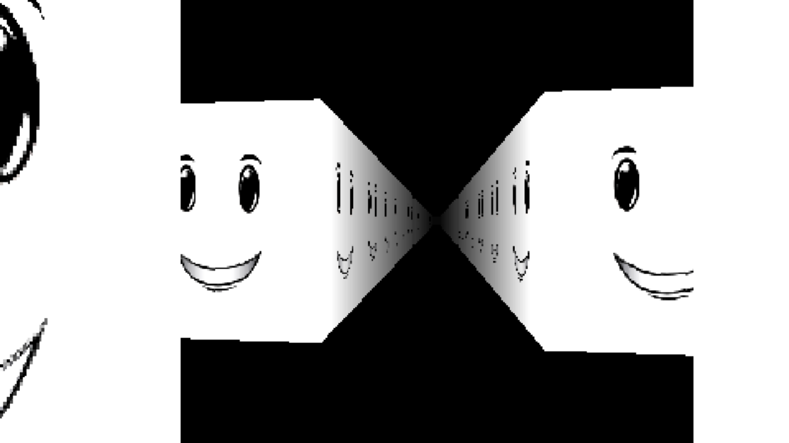

# KOIL 6:06



[PM 6:06](https://www.roblox.com/games/6033508889/PM-6-06) but on the Koil engine

GitHub Pages: https://tsoding.github.io/raycasting/

## Quick Start

```console
$ npm install
$ npm run watch
$ <browser> https://localhost:6969/
```

This script starts up http-server at http://localhost:6969/ to serve the content of the current folder and tsc in watch mode to constantly recompile [index.ts](./index.ts). See [watch.js](./watch.js) for more details.
